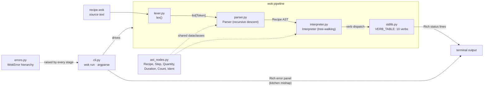

# Architecture

`wok` is a classic three-stage interpreter: **source → tokens → AST →
execution**. Every stage is hand-written and small enough to read in one
sitting — that's the point of the project.



## The pipeline, stage by stage

### 1. Lexer — `lexer.py`

`lex(source: str) -> list[Token]` scans the source line by line, emitting
`Token(kind, value, line, col)` dataclasses. Three things worth noticing:

- **Significant whitespace.** Indentation is tracked Python-style with an
  indent stack; entering a deeper level emits `INDENT`, leaving one emits
  `DEDENT` (possibly several at once). Tabs are rejected outright, and a
  level that doesn't match any open indent is an "inconsistent
  indentation" error. Blank lines and `#` comments are skipped *before*
  indent tracking, so they can't perturb the stack.
- **Numbers and units are separate tokens.** `200g` lexes as
  `NUMBER(200) UNIT(g)`. The lexer doesn't decide whether that's a mass or
  a time — that's the parser's job. An unknown unit glued to a number
  (`200gx`) is a lex-time error.
- **Keywords are contextual tokens.** Words like `for` and `in` get their
  own token kinds (`FOR`, `IN`) so the parser can use them as kwarg names
  without a reserved-word clash.

### 2. Parser — `parser.py`

A hand-written recursive-descent parser: one method per grammar rule
(`parse_recipe`, `parse_pantry`, `parse_step`, `parse_arglist`,
`parse_arg`, `parse_value`), built on three primitives — `peek`,
`advance`, `expect`. The grammar it implements:

```
recipe   := "recipe" IDENT "serves" NUMBER ":" NEWLINE INDENT pantry step+ DEDENT
pantry   := "pantry" ":" NEWLINE INDENT (IDENT "=" value NEWLINE)+ DEDENT
step     := IDENT "(" arglist? ")" NEWLINE
arglist  := arg ("," arg)*
arg      := kwarg | value
kwarg    := IDENT "=" value
value    := quantity | duration | count | IDENT
```

The parser is where `NUMBER UNIT` pairs become typed values: a unit in
`{min, s}` builds a `Duration`, any other unit builds a `Quantity`, and a
bare integer becomes a `Count`. This means the *kind* of every value is
settled at parse time — the interpreter never has to guess.

### 3. AST — `ast_nodes.py`

Plain dataclasses, no behavior beyond `__str__` for display:
`Recipe` (name, serves, pantry, steps), `PantryEntry`, `Step` (verb,
positional args, kwargs), and the value types `Quantity`, `Duration`,
`Count`, `Ident`. Every node carries its source `line` so errors anywhere
downstream can point back at the recipe text.

### 4. Interpreter — `interpreter.py`

A tree-walker with no surprises:

- `Environment` wraps the pantry dict. Resolving an `Ident` returns its
  *name*, not its pantry quantity — the pantry is inventory, not a
  substitution table. Unknown names raise `PantryError`, except for a
  small set of built-ins that every kitchen has (`water`, `salt`, `wok`,
  …) and, for `until=` only, state adjectives (`smoking`, `golden`, …).
- `Interpreter.run()` prints the header and pantry panel, then executes
  steps in order: look the verb up in `VERB_TABLE` (unknown verb →
  `KitchenError`), resolve each argument against the environment, run a
  unit sanity check (`for=` must be a `Duration`, else `MeasureError`),
  and call the verb.

### 5. Stdlib — `stdlib.py`

The ten verbs (`soak`, `heat`, `sauté`/`saute`, `crack`, `fold`, `boil`,
`chop`, `season`, `wait`, `serve`), each a plain function
`(args, kwargs, *, line, step_no)` registered in `VERB_TABLE`. Shared
helpers `_require` / `_no_extra` validate keyword arguments; domain rules
live in the verb itself (only things in `CRACKABLE` may be cracked,
`wait` insists on a `Duration`). Each verb's only side effect is printing
one Rich status line.

### 6. Errors — `errors.py` + `cli.py`

One base class, `WokError(message, line)`, with four leaves:
`SyntaxKitchenError` (lexer/parser), `PantryError`, `KitchenError`,
`MeasureError` (runtime). The CLI is the single place errors are caught
and rendered: `cmd_run` wraps the whole pipeline in one `except WokError`
and paints the "kitchen mishap" panel with the offending source line and
a caret, then exits 1. Stages raise; only the edge formats.

## One line, end to end

```
sauté(garlic, in=oil, for=30s)
```

1. **Lexer:** `IDENT(sauté) LPAREN IDENT(garlic) COMMA IN EQUALS
   IDENT(oil) COMMA FOR EQUALS NUMBER(30) UNIT(s) RPAREN NEWLINE`
2. **Parser:** `Step(verb="sauté", args=[Ident("garlic")],
   kwargs=[KwArg("in", Ident("oil")), KwArg("for", Duration(30, "s"))])`
3. **Interpreter:** resolves `garlic` and `oil` against the pantry,
   confirms `for=` is a `Duration`, dispatches to `verb_saute`.
4. **Stdlib:** validates the kwarg set and prints
   `[ 3] 🧄 Sautéing garlic in oil for 30s...`

## Design decisions

| Decision | Why |
|---|---|
| Hand-written lexer & parser, no generators | Pedagogy: the pipeline should be readable end to end |
| `NUMBER` + `UNIT` as separate tokens | Keeps the lexer dumb; the parser owns value typing |
| Value kinds fixed at parse time | The interpreter never re-inspects strings to decide types |
| Idents resolve to names, not quantities | Recipes talk about ingredients, not arithmetic on them |
| Errors raised deep, rendered once at the CLI | One formatting path; stages stay print-free (except verbs) |
| Verbs as flat functions in a dict | Adding verb #11 is one function + one table entry |

## Invariants

- Every AST node and every token carries a `line`; every `WokError`
  raised anywhere can therefore point at source.
- Pantry values are always concrete (`Quantity` / `Duration` / `Count`),
  never `Ident` — the grammar makes anything else unparseable.
- The interpreter writes nothing; all step output goes through the verbs,
  all error output through the CLI.
- Total source stays under 800 lines. If a change pushes past that, the
  change is wrong, not the limit.
