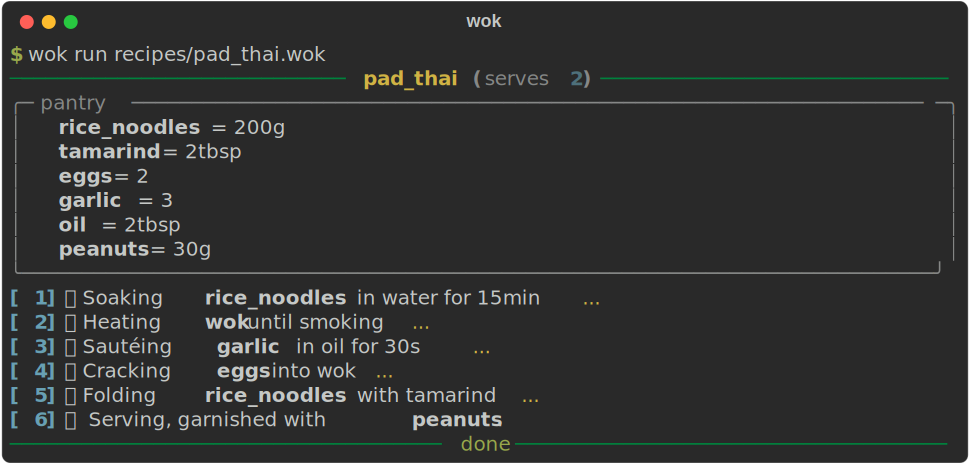

# wok

[](https://github.com/santapong/Wok/actions/workflows/ci.yml)
[](https://pypi.org/project/wok-lang/)
[](https://www.python.org/downloads/)
[](LICENSE)

A tiny recipe-as-language. `.wok` files look like recipes; the interpreter
executes them step-by-step and prints what's happening in the kitchen.



```
recipe pad_thai serves 2:
    pantry:
        rice_noodles = 200g
        tamarind = 2 tbsp
        eggs = 2
        garlic = 3
        oil = 2 tbsp
        peanuts = 30g

    soak(rice_noodles, in=water, for=15min)
    heat(wok, until=smoking)
    sauté(garlic, in=oil, for=30s)
    crack(eggs, into=wok)
    fold(rice_noodles, sauce=tamarind)
    serve(garnish=peanuts)
```

Running it:

```
$ wok run recipes/pad_thai.wok
───────────────────────── pad_thai (serves 2) ──────────────────────────
╭─ pantry ──────────────────────────────────────────────────────────────╮
│   rice_noodles = 200g                                                 │
│   tamarind = 2tbsp                                                    │
│   eggs = 2                                                            │
│   garlic = 3                                                          │
│   oil = 2tbsp                                                         │
│   peanuts = 30g                                                       │
╰───────────────────────────────────────────────────────────────────────╯
[ 1] 🌊 Soaking rice_noodles in water for 15min...
[ 2] 🔥 Heating wok until smoking...
[ 3] 🧄 Sautéing garlic in oil for 30s...
[ 4] 🥚 Cracking eggs into wok...
[ 5] 🥢 Folding rice_noodles with tamarind...
[ 6] 🍽️  Serving, garnished with peanuts.
───────────────────────────── done ─────────────────────────────────────
```

## Why

It's pedagogical. A full pipeline — source → tokens → AST → interpreted
execution — small enough to hold in your head. Hand-written lexer,
hand-written recursive-descent parser, tree-walking interpreter. No
parser generators, no AST libraries, no VMs.

## Install

```
pip install wok-lang
```

Or from a clone, for hacking:

```
pip install -e .
```

Requires Python 3.12+. The only runtime dep is [`rich`](https://github.com/Textualize/rich).

## Usage

```
wok --version
wok run path/to/recipe.wok
```

Three example recipes ship with the project:

```
wok run recipes/pad_thai.wok
wok run recipes/carbonara.wok
wok run recipes/omelette.wok
```

## Language reference

### Structure

A program is a single `recipe` block:

```
recipe <name> serves <int>:
    pantry:
        <ingredient> = <value>
        ...

    <verb>(<args>...)
    ...
```

Indentation is significant (Python-style: spaces only).

### Values

| Form          | Example       | Meaning                                  |
|---------------|---------------|------------------------------------------|
| Quantity      | `200g`, `2 tbsp` | mass / volume, used in the pantry     |
| Duration      | `30s`, `15min`   | time, used with `for=`                |
| Count         | `3`              | bare integer (e.g. "3 garlic")        |
| Identifier    | `rice_noodles`   | reference to a pantry item            |

Units: `g`, `ml`, `tbsp`, `tsp`, `cup` (quantity); `min`, `s` (duration).

### Verbs

All ten built-in verbs (in `wok/stdlib.py`):

| Verb     | Signature                                          |
|----------|----------------------------------------------------|
| `soak`   | `(ingredient, in=liquid, for=duration)`            |
| `heat`   | `(target, until=state \| for=duration)`            |
| `sauté`  | `(ingredient, in=fat, for=duration)`               |
| `crack`  | `(ingredient, into=target)` — only eggs allowed    |
| `fold`   | `(ingredient, sauce=ingredient?)`                  |
| `boil`   | `(ingredient, in=liquid, for=duration)`            |
| `chop`   | `(ingredient)`                                     |
| `season` | `(target, with=ingredient)`                        |
| `wait`   | `(duration)`                                       |
| `serve`  | `(garnish=ingredient?)`                            |

`sauté` is also spelled `saute` for the ASCII-bound.

### Errors

Three kitchen-themed errors. Each renders with a Rich panel showing the
offending line.

- `PantryError` — referenced an ingredient that isn't in the pantry
- `KitchenError` — used a verb wrong (e.g. cracking rice noodles)
- `MeasureError` — incompatible units

```
$ wok run /tmp/oops.wok
╭─ kitchen mishap ─────────────────────────────────────────────────╮
│ PantryError: ingredient 'mystery' not in pantry                  │
│                                                                  │
│ oops.wok:4                                                       │
│     4 │     chop(mystery)                                        │
│         │ ^^^^^^^^^^^^^                                          │
╰──────────────────────────────────────────────────────────────────╯
```

## Layout

```
wok/
├── lexer.py        # source → tokens
├── parser.py       # tokens → AST (recursive descent)
├── ast_nodes.py    # AST dataclasses
├── interpreter.py  # tree-walking eval
├── stdlib.py       # the 10 cooking verbs
├── errors.py       # PantryError, KitchenError, MeasureError
└── cli.py          # `wok run recipe.wok`
recipes/            # example .wok files
tests/              # pytest suite (lexer, parser, interpreter)
```

How the stages fit together is described in [ARCHITECTURE.md](ARCHITECTURE.md).

## Development

```
pip install -e '.[dev]'
pytest
```

The full test suite runs in well under a second. Contributions welcome —
see [CONTRIBUTING.md](CONTRIBUTING.md) for what fits (new recipes and
verbs especially).

## Non-goals

No user-defined functions, no type system, no VM, no plugins, no config.
Everything is a Quantity, Duration, Count, or Ident. Adding features
beyond the ten verbs would defeat the point.
